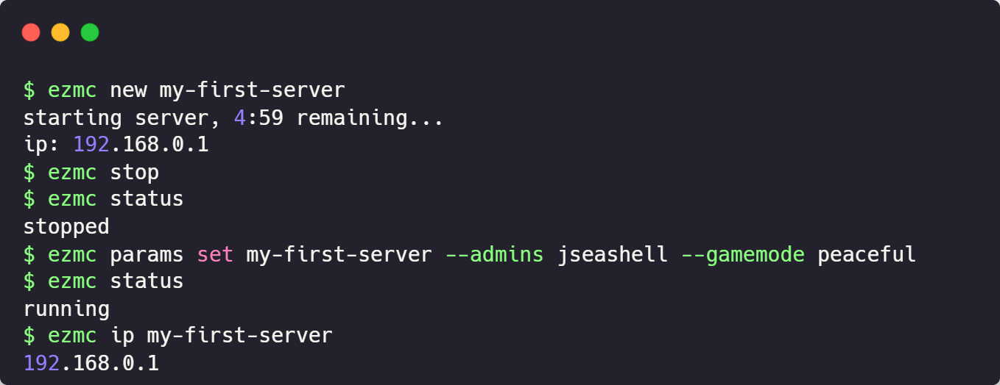

<p align="center" style="background: url(public/mc-dirt-banner.webp); padding: 2rem">
  
</p>

<p align="center">
    
    
    
    
    
    
    <a href="https://www.buymeacoffee.com/jseashell" aria-label="Buy me a coffee">
      
    </a>
</p>

A server management CLI for self-hosting Minecraft Java Edition with AWS Elastic Container Service. This project is a wrapper around the AWS SDK and [vatertime/minecraft-spot-pricing](https://github.com/vatertime/minecraft-spot-pricing), a CloudFormation template for managing resources that provisions the [itzg/docker-minecraft-server](https://github.com/itzg/docker-minecraft-server) Docker image.

<p align="center">
    
</p>

## Table of Contents

- [Features](#features)
- [Prerequisites](#prerequisites)
- [Commands](#commands)
- [Parameters](#parameters)
- [Infrastructure](#infrastructure)
- [Contributing](#contributing)
- [License](#license)

## Features

- Useful [commands](#commands) for orchestrating containers with the AWS SDK
- Supports vanilla and modded servers
- [vatertime/minecraft-spot-pricing](https://github.com/vatertime/minecraft-spot-pricing) claims an inexpensive $10/mo for a server running full-time. However, it's recommended to `stop` the server when not in use to save money. Spot pricing is set to 5¢.

## Prerequisites

- [Sign up](https://aws.amazon.com/free) for AWS. Be sure to setup billing.
- [Setup the AWS CLI](https://docs.aws.amazon.com/cli/latest/userguide/cli-chap-getting-started.html)
- Node.js v20+, `.nvmrc` is included

## Commands

| Command  | Description                                                                  |
| :------- | :--------------------------------------------------------------------------- |
| `cip`    | Copies a server's ip address to the clipboard.                               |
| `ip`     | Displays a server's ip address.                                              |
| `ls`     | Lists your servers.                                                          |
| `new`    | Creates a new server. Wait 5 minutes for commands like `ipaddr` or `status`. |
| `params` | Get/set server parameters.                                                   |
| `rm`     | Removes a server (cannot be undone).                                         |
| `start`  | Starts a server.                                                             |
| `status` | Displays a server's status.                                                  |
| `stop`   | Stops a server.                                                              |
| `help`   | Displays help.                                                               |

## Parameters

### Notable Defaults

| Option        | Value    |
| :------------ | :------- |
| Max players   | 10       |
| Difficulty    | Normal   |
| View Distance | 10       |
| Game Mode     | Survival |
| Level Type    | Default  |

## Infrastructure

Resources are provisioned using your default AWS CLI profile, falling back to `us-east-1` as a default region.

AWS Elastic Container Service is used to deploy the Minecraft image. EC2 instance(s) are spun up upon request and remain running until told to shutdown via the `stop` command (remove the server entirely with `rm`).

> Contributors are not responsible for any AWS costs incurred from using this CLI. Use at your own discretion.

Each "server" is given its own networking stack and ECS cluster for simple clean up -- keeps it ez. By default, your AWS account will be limited to 5 VPCs. With the default VPC, and assuming zero other provisioned resources, that means you can have a maximum of 4 servers operating simulateously.

## Contributing

### Pull Requests

Pull requests are welcomed. Please leave detailed reasoning for your change. Bugs should include reproduction steps. OS can sometimes be helpful but this project lets [commander.js](https://github.com/tj/commander.js) manage cross-platform compatibility.

### Development

```sh
# clone the repo
git clone git@github.com:jseashell/ezmc-cli.git
npm install
# build the project and deploy to global installs
npm run build
npm link
# verify with
ezmc ls
```

### Testing

```sh
# run tests
npm test
```

## License

This project is distributed under the terms of the [MIT License](./LICENSE).
